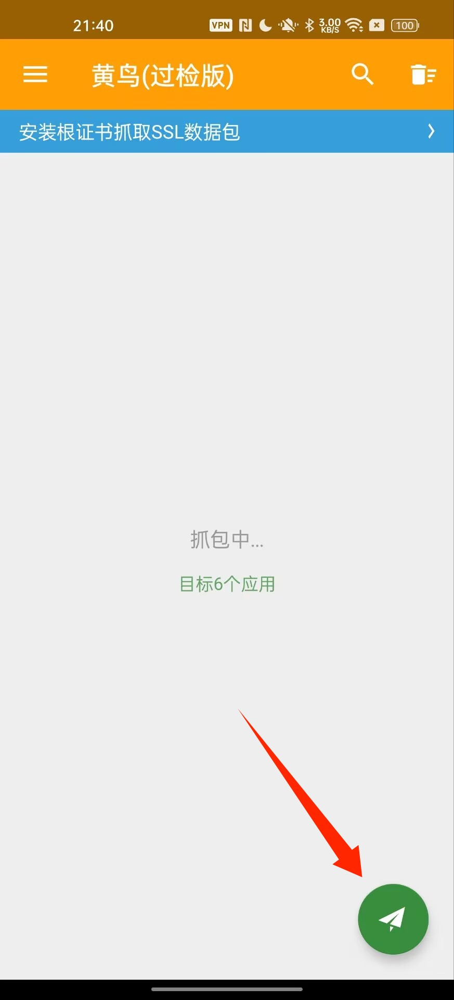
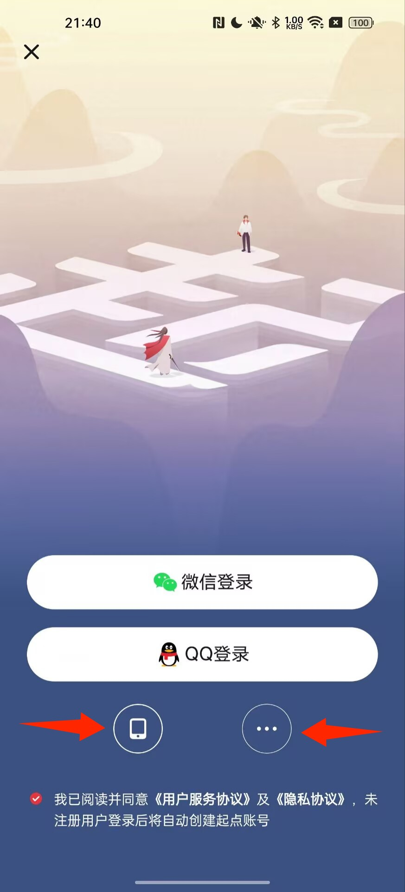
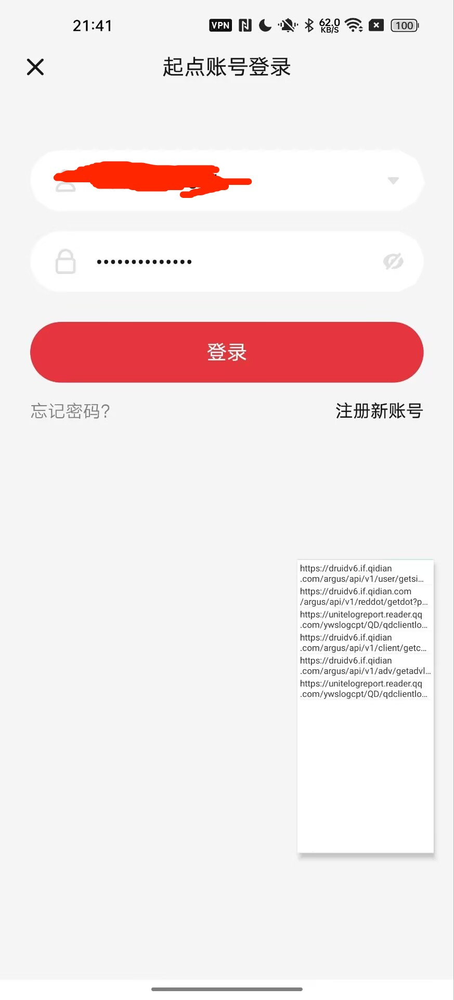
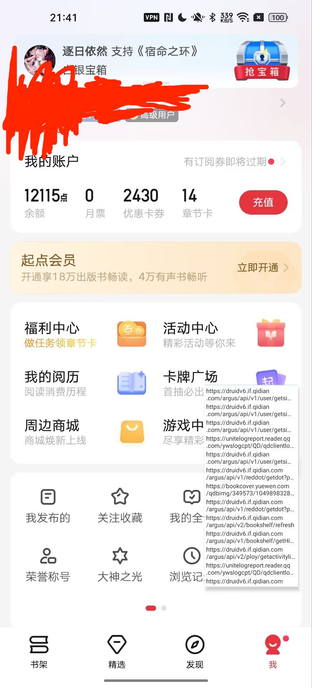
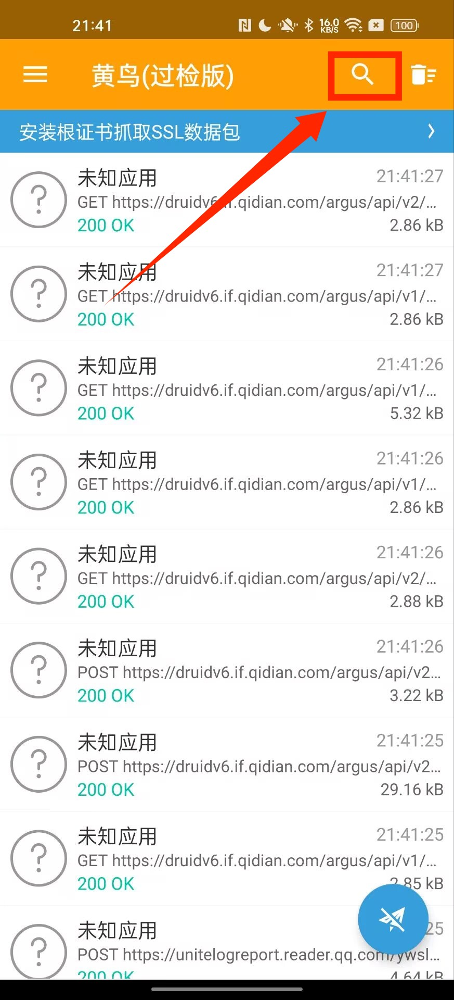
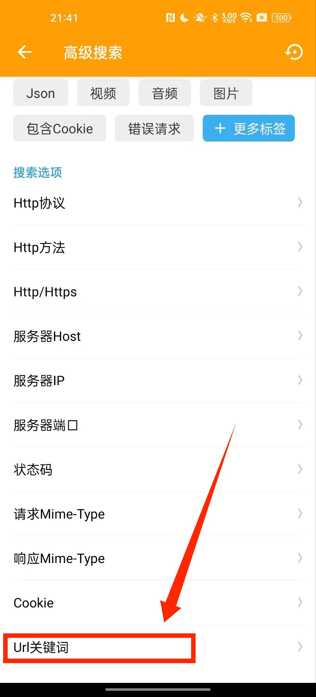
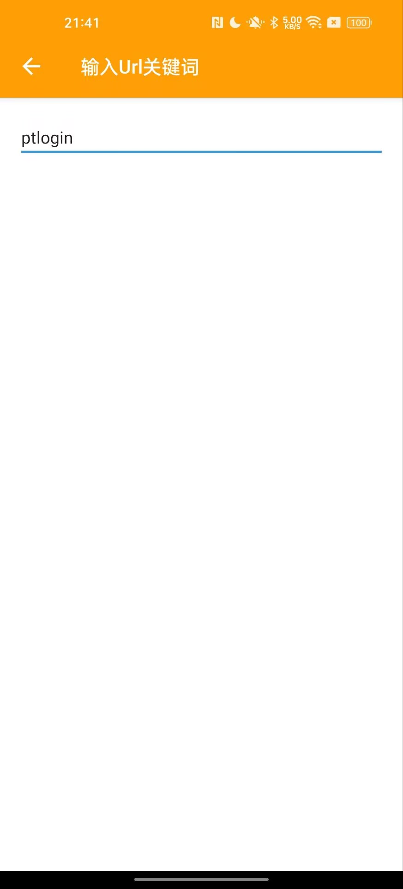
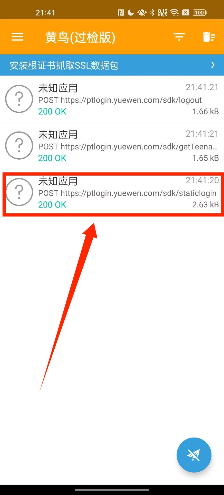
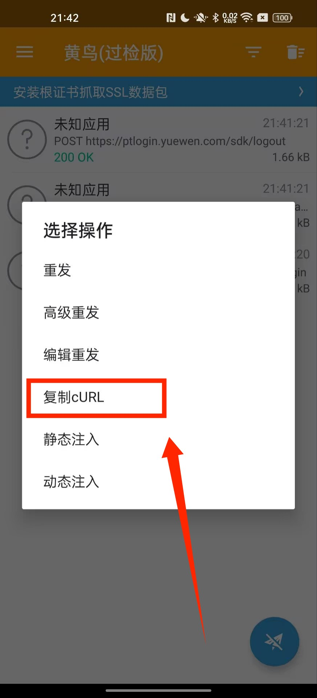
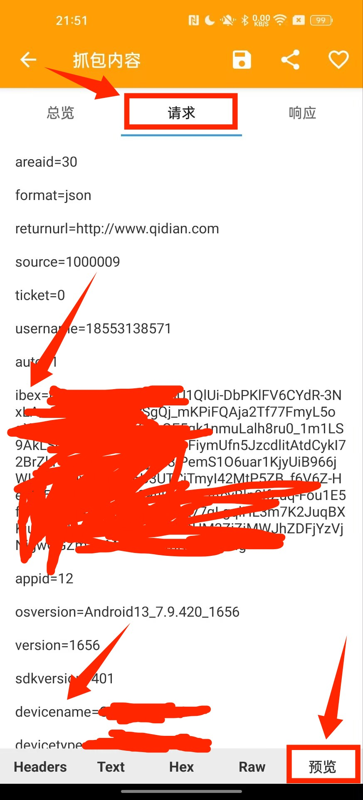

## 如何抓包获取真实设备数据

**注意事项**

- 只有7.9.430及以前的版本可以简单抓包，7.9.430版本及以后的由于360加固自带反抓包，需要额外手段才能抓包。

- 真实设备必须是你自己账号已经登录过一段时间，并且能正常领取奖励的设备。

**教程正文**

1. 打开抓包软件

   

2. 切换到起点，然后自己选择`手机验证码登录`或者`账号密码登录`

   - **验证码登录**：
      - `https://ptlogin.yuewen.com/sdk/sendphonecode`(获取验证码)
      - `https://ptlogin.yuewen.com/sdk/phonecodelogin`(填写验证码后点击登录)
   - **账号密码登录**：
      - `https://ptlogin6.qidian.com/sdk/staticlogin`(填写账号密码后点击登录)

   

3. 这里演示选择账号密码登录，验证码登录的方法类似。

   

4. 登录成功

   

5. 回到小黄鸟，点击上面的搜索

   

6. 找到url关键词

   

7. 输入ptlogin来寻找目标url

   

8. 回到主界面可以看到账号密码登录的目标url

   

9. 长按，复制curl。或者点进去，点击请求，选中下方的预览，一项一项地进行填入。

   

   